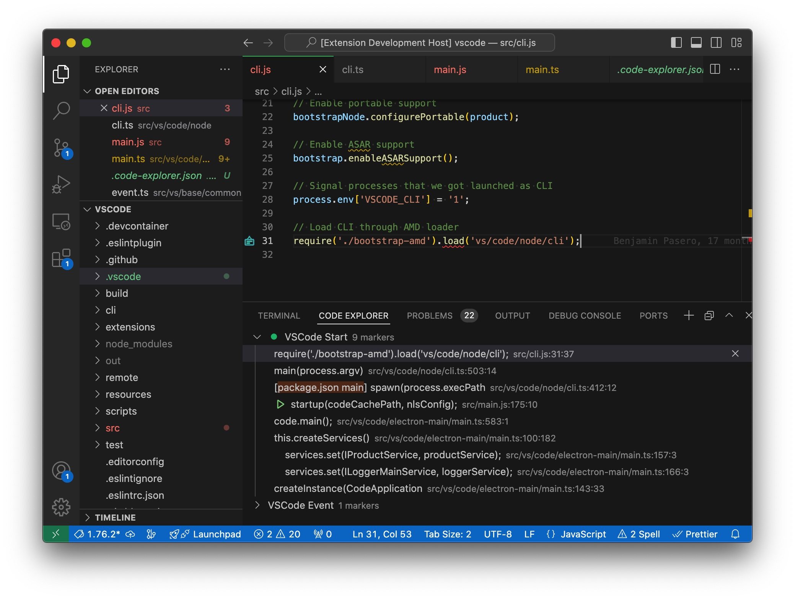

Code Explorer

> Mark code call chain like bookmark and more!

Explore codebase efficiently in VSCode with adding markers into a stack and switching among them.

## Features

- Add markers for code of files.
- Organize markers by stacks which are more like code call chain.
- Drag and drop markers and stacks to re-order them.
- Set title, icon, tags for a marker.
- Copy markers as markdown into clipboard.
- (TODO) Add gutter for the line of marker
- Data is saved in workspace .vscode dir with JSON format.
- Support multiple folder workspace.
- (TODO/Maybe) Indent/Unindent markers to make it more like call hierarchy.

## Usage

1. Install this extension. Download from [VSCode Market](https://marketplace.visualstudio.com/items?itemName=tianjianchn.code-explorer) or search `tianjianchn.code-explorer` in VSCode extension sidebar.
2. Open the `CODE EXPLORER` panel in VSCode bottom panels.
3. Open a source code file and select a statement, then run the command `Code Explorer: Add Code Marker`(or through context menu) to push a new marker into current stack.
4. Repeat last step when you are reading the code repo.
5. Click markers in the stack to switch back and forward.

Right click markers and stacks to get more actions.
